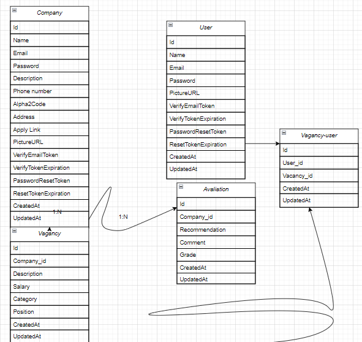
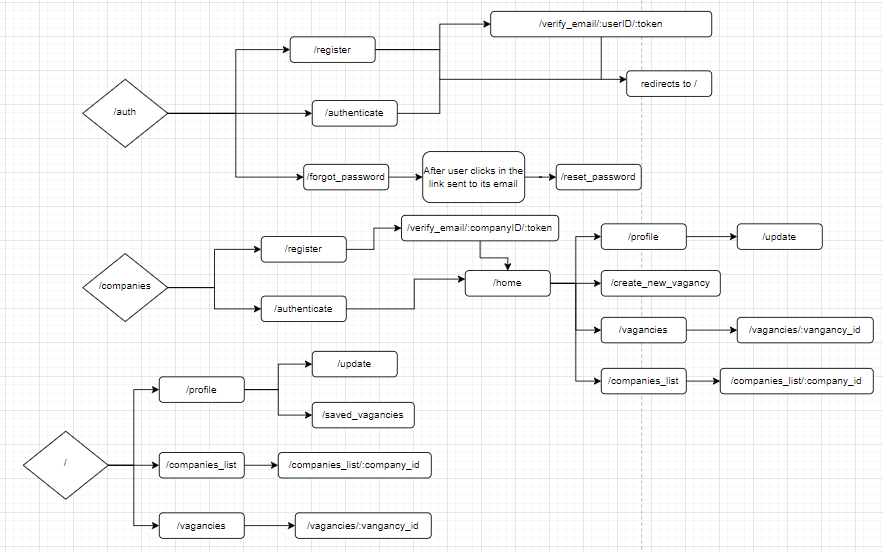

<p align="center">
    <h2 align="center" >YourJob</h2>
</p>

This is the backend for YourJob.com, built with nodejs, typescript and using express as framework.

### Libraries in use

- Bcryptjs
- Cors
- Dotenv
- Ejs
- Google-libphonenumber
- Html-to-text
- Jsonwebtoken
- Juice
- Nodemailer
- Sequelize

### Progress

- [x] User auth routes
    - [x] Register
    - [x] Verify email
    - [x] Authenticate
    - [x] Forgot password
    - [x] Reset password

- [x] Company auth routes
    - [x] Register
    - [x] Verify email
    - [x] Authenticate
    - [x] Forgot password
    - [x] Reset password

- [ ] Profile
- [x] Create new vagancy
- [x] Vagancies list
- [ ] Companies list
- [ ] Update profile
- [ ] Manage vangacies
- [ ] Unique vagancy
- [ ] Unique company


### Diagrams

<p align="center">
    <h2 align="center" >Database</h2>
    </img>
</p>
<br />
<p align="center">
    <h2 align="center" >Routes</h2>
    </img>
</p>

### How to contribute

```
    >> Fork this repository

    >> Create a new branch containing your feature
    git checkout -b feature

    >> Commit your changes
    git commit -m "new feature"

    >> Push to your branch
    git push origin feature

    >> After your pull request's merge has been done, you can delete your branch

```

---

### Author

- Website - [Romario Negreiros](https://romario-negreiros.github.io/Romario-frontend/)
- Frontend Mentor - [@Romario-Negreiros](https://www.frontendmentor.io/profile/Romario-Negreiros)
